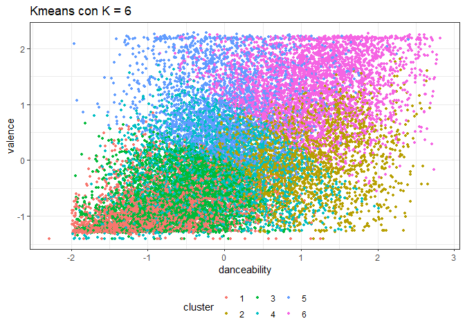

Pauta Proyecto 1
================

Este es un ejemplo de lo que se esperaba que realizaran en el proyecto 1
logrando lo pedido en el enunciado.

Ejemplo mediante RMarkdown, que permite que sea más amigable para
presentar el reporte de lo que estén analizando, o en este caso para la
entrega de un proyecto

(También pueden instalar la librería de GitHub, lo que permite cargar un
template diseñado para presentar el reporte en dicha plataforma)

## Importar Librerías y Datos

    ## 
    ## Attaching package: 'dplyr'

    ## The following objects are masked from 'package:stats':
    ## 
    ##     filter, lag

    ## The following objects are masked from 'package:base':
    ## 
    ##     intersect, setdiff, setequal, union

    ## -- Attaching packages --------------------------------------- tidyverse 1.3.1 --

    ## v ggplot2 3.3.5     v purrr   0.3.4
    ## v tibble  3.1.2     v stringr 1.4.0
    ## v tidyr   1.2.0     v forcats 0.5.1
    ## v readr   1.4.0

    ## -- Conflicts ------------------------------------------ tidyverse_conflicts() --
    ## x dplyr::filter() masks stats::filter()
    ## x dplyr::lag()    masks stats::lag()

    ## Registered S3 method overwritten by 'GGally':
    ##   method from   
    ##   +.gg   ggplot2

    ## corrplot 0.90 loaded

## Revisar Dataset

``` r
head(data)  # Revisamos las primeras filas del dataset
```

    ##   artist_name              artist_id               album_id album_type
    ## 1        2Pac 1ZwdS5xdxEREPySFridCfh 1nGbXgS6toEOcFCDwEl5R3      album
    ## 2        2Pac 1ZwdS5xdxEREPySFridCfh 1nGbXgS6toEOcFCDwEl5R3      album
    ## 3        2Pac 1ZwdS5xdxEREPySFridCfh 1nGbXgS6toEOcFCDwEl5R3      album
    ## 4        2Pac 1ZwdS5xdxEREPySFridCfh 1nGbXgS6toEOcFCDwEl5R3      album
    ## 5        2Pac 1ZwdS5xdxEREPySFridCfh 1nGbXgS6toEOcFCDwEl5R3      album
    ## 6        2Pac 1ZwdS5xdxEREPySFridCfh 1nGbXgS6toEOcFCDwEl5R3      album
    ##   album_release_date album_release_year album_release_date_precision
    ## 1         2019-08-01               2019                          day
    ## 2         2019-08-01               2019                          day
    ## 3         2019-08-01               2019                          day
    ## 4         2019-08-01               2019                          day
    ## 5         2019-08-01               2019                          day
    ## 6         2019-08-01               2019                          day
    ##   danceability energy key loudness mode speechiness acousticness
    ## 1        0.656  0.882   0   -3.011    1      0.0941      0.03300
    ## 2        0.810  0.642   8   -8.647    1      0.2440      0.04800
    ## 3        0.548  0.590   4   -9.301    0      0.4750      0.11300
    ## 4        0.839  0.657   5   -4.959    0      0.2220      0.05260
    ## 5        0.854  0.694   0   -4.258    0      0.1230      0.00944
    ## 6        0.697  0.598   2   -9.604    1      0.1360      0.00522
    ##   instrumentalness liveness valence   tempo               track_id
    ## 1         0.000000   0.6700   0.782  91.661 6ayeqYtOtwVhqVB6k6MKoh
    ## 2         0.000000   0.2640   0.694  90.956 1UDsnzBp8gUCFsrzUDlZI9
    ## 3         0.000722   0.2290   0.267  87.841 3bKs15o7F9VP6GBExCbb6H
    ## 4         0.000106   0.3910   0.615  85.111 4L0iAst3yLonw8aGxTRCvb
    ## 5         0.071900   0.0767   0.776 104.379 66men3J5qFERvIY06M5hQ9
    ## 6         0.000000   0.1720   0.387  85.862 7GVCAVH7SZnjrzHI1FmfeA
    ##                                                       analysis_url
    ## 1 https://api.spotify.com/v1/audio-analysis/6ayeqYtOtwVhqVB6k6MKoh
    ## 2 https://api.spotify.com/v1/audio-analysis/1UDsnzBp8gUCFsrzUDlZI9
    ## 3 https://api.spotify.com/v1/audio-analysis/3bKs15o7F9VP6GBExCbb6H
    ## 4 https://api.spotify.com/v1/audio-analysis/4L0iAst3yLonw8aGxTRCvb
    ## 5 https://api.spotify.com/v1/audio-analysis/66men3J5qFERvIY06M5hQ9
    ## 6 https://api.spotify.com/v1/audio-analysis/7GVCAVH7SZnjrzHI1FmfeA
    ##   time_signature disc_number duration_ms explicit
    ## 1              4           1      347973    FALSE
    ## 2              4           1      241026    FALSE
    ## 3              4           1      240013    FALSE
    ## 4              4           1      295026    FALSE
    ## 5              4           1      241000    FALSE
    ## 6              4           1      224026    FALSE
    ##                                                 track_href is_local
    ## 1 https://api.spotify.com/v1/tracks/6ayeqYtOtwVhqVB6k6MKoh    FALSE
    ## 2 https://api.spotify.com/v1/tracks/1UDsnzBp8gUCFsrzUDlZI9    FALSE
    ## 3 https://api.spotify.com/v1/tracks/3bKs15o7F9VP6GBExCbb6H    FALSE
    ## 4 https://api.spotify.com/v1/tracks/4L0iAst3yLonw8aGxTRCvb    FALSE
    ## 5 https://api.spotify.com/v1/tracks/66men3J5qFERvIY06M5hQ9    FALSE
    ## 6 https://api.spotify.com/v1/tracks/7GVCAVH7SZnjrzHI1FmfeA    FALSE
    ##               track_name
    ## 1        California Love
    ## 2 Slippin' Into Darkness
    ## 3            Ride or Die
    ## 4     I Ain't Mad At Cha
    ## 5              Static II
    ## 6                Runnin'
    ##                                                                                             track_preview_url
    ## 1 https://p.scdn.co/mp3-preview/93e456ef0b73f23f50eeadaeaad852d79d4f4610?cid=ac26d97eca664234ab133e5208ea5737
    ## 2 https://p.scdn.co/mp3-preview/440595604d3f49464bcf28efc867f7df31d62e53?cid=ac26d97eca664234ab133e5208ea5737
    ## 3 https://p.scdn.co/mp3-preview/cc18dc90d609d37591e5993615a0cea1fa25f428?cid=ac26d97eca664234ab133e5208ea5737
    ## 4 https://p.scdn.co/mp3-preview/d138f0170423cd9a14f31006d4add57c07f705c4?cid=ac26d97eca664234ab133e5208ea5737
    ## 5 https://p.scdn.co/mp3-preview/dddb7d0ea0205338a00c591e6045b0c21cd7c9fc?cid=ac26d97eca664234ab133e5208ea5737
    ## 6 https://p.scdn.co/mp3-preview/fc169c99acc9d8bb19b34cf1aaad9f1b0b9b68e8?cid=ac26d97eca664234ab133e5208ea5737
    ##   track_number  type                            track_uri
    ## 1            1 track spotify:track:6ayeqYtOtwVhqVB6k6MKoh
    ## 2            2 track spotify:track:1UDsnzBp8gUCFsrzUDlZI9
    ## 3            3 track spotify:track:3bKs15o7F9VP6GBExCbb6H
    ## 4            4 track spotify:track:4L0iAst3yLonw8aGxTRCvb
    ## 5            5 track spotify:track:66men3J5qFERvIY06M5hQ9
    ## 6            6 track spotify:track:7GVCAVH7SZnjrzHI1FmfeA
    ##                                   external_urls.spotify      album_name
    ## 1 https://open.spotify.com/track/6ayeqYtOtwVhqVB6k6MKoh California Love
    ## 2 https://open.spotify.com/track/1UDsnzBp8gUCFsrzUDlZI9 California Love
    ## 3 https://open.spotify.com/track/3bKs15o7F9VP6GBExCbb6H California Love
    ## 4 https://open.spotify.com/track/4L0iAst3yLonw8aGxTRCvb California Love
    ## 5 https://open.spotify.com/track/66men3J5qFERvIY06M5hQ9 California Love
    ## 6 https://open.spotify.com/track/7GVCAVH7SZnjrzHI1FmfeA California Love
    ##   key_name mode_name key_mode
    ## 1        C     major  C major
    ## 2       G#     major G# major
    ## 3        E     minor  E minor
    ## 4        F     minor  F minor
    ## 5        C     minor  C minor
    ## 6        D     major  D major

``` r
colnames(data) # Revisamos las columnas que lo componen
```

    ##  [1] "artist_name"                  "artist_id"                   
    ##  [3] "album_id"                     "album_type"                  
    ##  [5] "album_release_date"           "album_release_year"          
    ##  [7] "album_release_date_precision" "danceability"                
    ##  [9] "energy"                       "key"                         
    ## [11] "loudness"                     "mode"                        
    ## [13] "speechiness"                  "acousticness"                
    ## [15] "instrumentalness"             "liveness"                    
    ## [17] "valence"                      "tempo"                       
    ## [19] "track_id"                     "analysis_url"                
    ## [21] "time_signature"               "disc_number"                 
    ## [23] "duration_ms"                  "explicit"                    
    ## [25] "track_href"                   "is_local"                    
    ## [27] "track_name"                   "track_preview_url"           
    ## [29] "track_number"                 "type"                        
    ## [31] "track_uri"                    "external_urls.spotify"       
    ## [33] "album_name"                   "key_name"                    
    ## [35] "mode_name"                    "key_mode"

``` r
glimpse(data) # Revisamos la estructura de dato de las columnas
```

    ## Rows: 447,622
    ## Columns: 36
    ## $ artist_name                  <chr> "2Pac", "2Pac", "2Pac", "2Pac", "2Pac", "~
    ## $ artist_id                    <chr> "1ZwdS5xdxEREPySFridCfh", "1ZwdS5xdxEREPy~
    ## $ album_id                     <chr> "1nGbXgS6toEOcFCDwEl5R3", "1nGbXgS6toEOcF~
    ## $ album_type                   <chr> "album", "album", "album", "album", "albu~
    ## $ album_release_date           <chr> "2019-08-01", "2019-08-01", "2019-08-01",~
    ## $ album_release_year           <dbl> 2019, 2019, 2019, 2019, 2019, 2019, 2019,~
    ## $ album_release_date_precision <chr> "day", "day", "day", "day", "day", "day",~
    ## $ danceability                 <dbl> 0.656, 0.810, 0.548, 0.839, 0.854, 0.697,~
    ## $ energy                       <dbl> 0.882, 0.642, 0.590, 0.657, 0.694, 0.598,~
    ## $ key                          <int> 0, 8, 4, 5, 0, 2, 1, 11, 11, 7, 5, 8, 11,~
    ## $ loudness                     <dbl> -3.011, -8.647, -9.301, -4.959, -4.258, -~
    ## $ mode                         <int> 1, 1, 0, 0, 0, 1, 0, 0, 1, 1, 0, 1, 0, 1,~
    ## $ speechiness                  <dbl> 0.0941, 0.2440, 0.4750, 0.2220, 0.1230, 0~
    ## $ acousticness                 <dbl> 0.03300, 0.04800, 0.11300, 0.05260, 0.009~
    ## $ instrumentalness             <dbl> 0.00e+00, 0.00e+00, 7.22e-04, 1.06e-04, 7~
    ## $ liveness                     <dbl> 0.6700, 0.2640, 0.2290, 0.3910, 0.0767, 0~
    ## $ valence                      <dbl> 0.782, 0.694, 0.267, 0.615, 0.776, 0.387,~
    ## $ tempo                        <dbl> 91.661, 90.956, 87.841, 85.111, 104.379, ~
    ## $ track_id                     <chr> "6ayeqYtOtwVhqVB6k6MKoh", "1UDsnzBp8gUCFs~
    ## $ analysis_url                 <chr> "https://api.spotify.com/v1/audio-analysi~
    ## $ time_signature               <int> 4, 4, 4, 4, 4, 4, 4, 4, 4, 4, 4, 4, 4, 4,~
    ## $ disc_number                  <int> 1, 1, 1, 1, 1, 1, 1, 1, 1, 1, 1, 1, 1, 1,~
    ## $ duration_ms                  <int> 347973, 241026, 240013, 295026, 241000, 2~
    ## $ explicit                     <lgl> FALSE, FALSE, FALSE, FALSE, FALSE, FALSE,~
    ## $ track_href                   <chr> "https://api.spotify.com/v1/tracks/6ayeqY~
    ## $ is_local                     <lgl> FALSE, FALSE, FALSE, FALSE, FALSE, FALSE,~
    ## $ track_name                   <chr> "California Love", "Slippin' Into Darknes~
    ## $ track_preview_url            <chr> "https://p.scdn.co/mp3-preview/93e456ef0b~
    ## $ track_number                 <int> 1, 2, 3, 4, 5, 6, 7, 8, 9, 10, 11, 12, 13~
    ## $ type                         <chr> "track", "track", "track", "track", "trac~
    ## $ track_uri                    <chr> "spotify:track:6ayeqYtOtwVhqVB6k6MKoh", "~
    ## $ external_urls.spotify        <chr> "https://open.spotify.com/track/6ayeqYtOt~
    ## $ album_name                   <chr> "California Love", "California Love", "Ca~
    ## $ key_name                     <chr> "C", "G#", "E", "F", "C", "D", "C#", "B",~
    ## $ mode_name                    <chr> "major", "major", "minor", "minor", "mino~
    ## $ key_mode                     <chr> "C major", "G# major", "E minor", "F mino~

``` r
summary(data) # Resumen de datos
```

    ##  artist_name         artist_id           album_id          album_type       
    ##  Length:447622      Length:447622      Length:447622      Length:447622     
    ##  Class :character   Class :character   Class :character   Class :character  
    ##  Mode  :character   Mode  :character   Mode  :character   Mode  :character  
    ##                                                                             
    ##                                                                             
    ##                                                                             
    ##                                                                             
    ##  album_release_date album_release_year album_release_date_precision
    ##  Length:447622      Min.   :   0       Length:447622               
    ##  Class :character   1st Qu.:2010       Class :character            
    ##  Mode  :character   Median :2019       Mode  :character            
    ##                     Mean   :2013                                   
    ##                     3rd Qu.:2020                                   
    ##                     Max.   :2021                                   
    ##                     NA's   :447                                    
    ##   danceability        energy            key            loudness      
    ##  Min.   :0.0000   Min.   :0.0000   Min.   : 0.000   Min.   :-60.000  
    ##  1st Qu.:0.2520   1st Qu.:0.0756   1st Qu.: 2.000   1st Qu.:-24.445  
    ##  Median :0.3700   Median :0.2100   Median : 5.000   Median :-19.477  
    ##  Mean   :0.3911   Mean   :0.3405   Mean   : 5.061   Mean   :-18.672  
    ##  3rd Qu.:0.5140   3rd Qu.:0.5820   3rd Qu.: 8.000   3rd Qu.:-11.644  
    ##  Max.   :0.9860   Max.   :1.0000   Max.   :11.000   Max.   :  0.496  
    ##                                                                      
    ##       mode         speechiness       acousticness    instrumentalness 
    ##  Min.   :0.0000   Min.   :0.00000   Min.   :0.0000   Min.   :0.00000  
    ##  1st Qu.:0.0000   1st Qu.:0.03780   1st Qu.:0.3940   1st Qu.:0.00169  
    ##  Median :1.0000   Median :0.04430   Median :0.9230   Median :0.71500  
    ##  Mean   :0.6834   Mean   :0.06892   Mean   :0.6987   Mean   :0.50607  
    ##  3rd Qu.:1.0000   3rd Qu.:0.05840   3rd Qu.:0.9860   3rd Qu.:0.90100  
    ##  Max.   :1.0000   Max.   :0.97100   Max.   :0.9960   Max.   :1.00000  
    ##                                                                       
    ##     liveness         valence           tempo          track_id        
    ##  Min.   :0.0000   Min.   :0.0000   Min.   :  0.00   Length:447622     
    ##  1st Qu.:0.0968   1st Qu.:0.0894   1st Qu.: 82.39   Class :character  
    ##  Median :0.1230   Median :0.2740   Median :105.72   Mode  :character  
    ##  Mean   :0.2217   Mean   :0.3374   Mean   :108.74                     
    ##  3rd Qu.:0.2530   3rd Qu.:0.5370   3rd Qu.:131.05                     
    ##  Max.   :1.0000   Max.   :0.9960   Max.   :244.95                     
    ##                                                                       
    ##  analysis_url       time_signature   disc_number      duration_ms     
    ##  Length:447622      Min.   :0.000   Min.   : 1.000   Min.   :   1066  
    ##  Class :character   1st Qu.:4.000   1st Qu.: 1.000   1st Qu.: 123440  
    ##  Mode  :character   Median :4.000   Median : 1.000   Median : 194961  
    ##                     Mean   :3.728   Mean   : 1.212   Mean   : 229110  
    ##                     3rd Qu.:4.000   3rd Qu.: 1.000   3rd Qu.: 271560  
    ##                     Max.   :5.000   Max.   :26.000   Max.   :4796395  
    ##                                                                       
    ##   explicit        track_href         is_local        track_name       
    ##  Mode :logical   Length:447622      Mode :logical   Length:447622     
    ##  FALSE:442045    Class :character   FALSE:447622    Class :character  
    ##  TRUE :5577      Mode  :character                   Mode  :character  
    ##                                                                       
    ##                                                                       
    ##                                                                       
    ##                                                                       
    ##  track_preview_url   track_number       type            track_uri        
    ##  Length:447622      Min.   :  1.0   Length:447622      Length:447622     
    ##  Class :character   1st Qu.:  6.0   Class :character   Class :character  
    ##  Mode  :character   Median : 11.0   Mode  :character   Mode  :character  
    ##                     Mean   : 44.6                                        
    ##                     3rd Qu.: 30.0                                        
    ##                     Max.   :545.0                                        
    ##                                                                          
    ##  external_urls.spotify  album_name          key_name          mode_name        
    ##  Length:447622         Length:447622      Length:447622      Length:447622     
    ##  Class :character      Class :character   Class :character   Class :character  
    ##  Mode  :character      Mode  :character   Mode  :character   Mode  :character  
    ##                                                                                
    ##                                                                                
    ##                                                                                
    ##                                                                                
    ##    key_mode        
    ##  Length:447622     
    ##  Class :character  
    ##  Mode  :character  
    ##                    
    ##                    
    ##                    
    ## 

## Limpieza de Datos

### Existencia NA’s

``` r
colSums(is.na(data))
```

    ##                  artist_name                    artist_id 
    ##                            0                            0 
    ##                     album_id                   album_type 
    ##                            0                            0 
    ##           album_release_date           album_release_year 
    ##                            0                          447 
    ## album_release_date_precision                 danceability 
    ##                            0                            0 
    ##                       energy                          key 
    ##                            0                            0 
    ##                     loudness                         mode 
    ##                            0                            0 
    ##                  speechiness                 acousticness 
    ##                            0                            0 
    ##             instrumentalness                     liveness 
    ##                            0                            0 
    ##                      valence                        tempo 
    ##                            0                            0 
    ##                     track_id                 analysis_url 
    ##                            0                            0 
    ##               time_signature                  disc_number 
    ##                            0                            0 
    ##                  duration_ms                     explicit 
    ##                            0                            0 
    ##                   track_href                     is_local 
    ##                            0                            0 
    ##                   track_name            track_preview_url 
    ##                            0                       174714 
    ##                 track_number                         type 
    ##                            0                            0 
    ##                    track_uri        external_urls.spotify 
    ##                            0                            0 
    ##                   album_name                     key_name 
    ##                            0                            0 
    ##                    mode_name                     key_mode 
    ##                            0                            0

``` r
sum(is.na(data))
```

    ## [1] 175161

Antes de eliminar los NA’s (si se encuentran), se verá si estos influyen
o no en el análisis según las columnas que se decida utilizar

Se ve que existen NA’s en las columnas de album_release_year(447) y
track_preview_url(174714), como no son importantes para el análisis no
es necesario borrar estos datos

### Existencia de Duplicados

Revisamos si existen canciones duplicadas, para esto revisamos que el
nombre de la canción y el nombre del artista coincidan.

``` r
data0 <- data[!duplicated(data[c("artist_name","track_name")]),]

nrow(data)
```

    ## [1] 447622

``` r
nrow(data0)
```

    ## [1] 190818

``` r
filas_borradas <- nrow(data) - nrow(data0)
filas_borradas
```

    ## [1] 256804

``` r
#Borramos el dataframe inicial por un tema de uso de memoria
rm(data)
```

Como se puede ver nuestro dataset se vio disminuido en 256804 canciones
que tenían el mismo nombre de canción y artista

#### Transformamos el tiempo a minutos, y cambiamos el tipo de dato para key y mode

``` r
data0 <- data0 %>% mutate(duration_min = duration_ms/60000) #Pasamos a minutos la duración
data0$key <- as.numeric(data0$key)
data0$mode <- as.numeric(data0$mode)
```

### Separamos variables numéricas y de carácter relevantes

``` r
num <- c("danceability","energy","key","loudness","mode","speechiness","acousticness","instrumentalness",
         "liveness","valence","tempo")
num_data <- data0 %>% dplyr::select(all_of(num))

#Se incluye aquí disc_number y duration_ms, ya que son características de la canción que no son relevantes para el análisis de clusters
chr <- c("track_name","artist_name","album_name","disc_number","duration_ms")
chr_data <- data0 %>% select(all_of(chr))

#Escalamos las variables numéricas
num_esc <- scale(num_data)
```

### Revisamos correlación entre las variables

``` r
correlacion <- round(cor(num_esc), 2)
correlacion[upper.tri(correlacion)] <- 0

vars_pos <- correlacion[1 > correlacion & correlacion > 0.5] #Podemos ver que los valores más altos de correlación son 0.85 y 0.6 (en el plot se podrá identificar cuáles son las variables)

corrplot(correlacion, method="number", type="lower", number.font = 0.5, tl.cex = 1) 
```

<!-- -->

``` r
num_esc <- num_esc %>% as.data.frame()

vars_final <- c("danceability","energy","loudness","valence")
num_esc <- num_esc %>% select(all_of(vars_final)) %>% as.data.frame()
```

Al ver el corrplot podemos ver que las variables con correlación más
alta son energy-loudness y danceability-valence, por lo que tomaremos
estas 4 variables para nuestro posterior análisis

### Para finalizar vamos a generar un sample representativo de nuestra población

``` r
set.seed(123)

#Primero revisamos el summary de las variables con las que vamos a trabajar
summary(num_esc)
```

    ##   danceability          energy           loudness           valence       
    ##  Min.   :-2.28431   Min.   :-1.1966   Min.   :-5.20508   Min.   :-1.4029  
    ##  1st Qu.:-0.75502   1st Qu.:-0.8799   1st Qu.:-0.73204   1st Qu.:-0.8792  
    ##  Median :-0.09585   Median :-0.3455   Median : 0.02361   Median :-0.1699  
    ##  Mean   : 0.00000   Mean   : 0.0000   Mean   : 0.00000   Mean   : 0.0000  
    ##  3rd Qu.: 0.72153   3rd Qu.: 0.8863   3rd Qu.: 0.90390   3rd Qu.: 0.7466  
    ##  Max.   : 2.91526   Max.   : 2.0029   Max.   : 1.95364   Max.   : 2.2962

``` r
#Luego utilizamos la función sample_frac de dplyr para generar un muestreo aleatorio del 10% de la población
data_sample <- sample_frac(num_esc, 0.1)

#Finalmente revisamos el summary de nuestra muestra y comparamos con los valores de la población total
summary(data_sample)
```

    ##   danceability           energy             loudness        
    ##  Min.   :-2.284308   Min.   :-1.196628   Min.   :-5.205083  
    ##  1st Qu.:-0.755023   1st Qu.:-0.879230   1st Qu.:-0.739284  
    ##  Median :-0.101122   Median :-0.351941   Median : 0.014502  
    ##  Mean   :-0.004361   Mean   : 0.001063   Mean   :-0.001705  
    ##  3rd Qu.: 0.710981   3rd Qu.: 0.902291   3rd Qu.: 0.901266  
    ##  Max.   : 2.815067   Max.   : 2.002943   Max.   : 1.870923  
    ##     valence         
    ##  Min.   :-1.402904  
    ##  1st Qu.:-0.882942  
    ##  Median :-0.173567  
    ##  Mean   :-0.001221  
    ##  3rd Qu.: 0.743793  
    ##  Max.   : 2.281393

``` r
data1 <- data_sample
```

Al comparar los valores podemos ver que si bien hay algunos de los
estadísticos que cambian, las variaciones son mínimas por lo que podemos
considerar que nuestra muestra es una buena representación de la
población

Una vez que ya hemos logrado limpiar nuestros datos y generar el
dataframe final, seguimos con el análisis de clustering

## Modelo 1: K-Means

Primero probamos una configuración al azar de K-Means para ver que se
obtiene con K = 15

``` r
set.seed(123)
df1 <- data1

modelo_kmeans1 <- kmeans(df1, centers = 15)

# Se crea la variable cluster en la tabla df1
df1$cluster <- modelo_kmeans1$cluster %>% as.factor()

# Se grafican los clusters formados

ggplot(data = df1, aes(x = loudness,y = energy, color = cluster)) +
  geom_point(size = 1) +
  labs(title = "Kmeans con K = 15") +
  theme_bw() +
  theme(legend.position = "bottom")
```

<!-- -->

``` r
ggplot(data = df1, aes(x = danceability,y = valence, color = cluster)) +
  geom_point(size = 1) +
  labs(title = "Kmeans con K = 15") +
  theme_bw() +
  theme(legend.position = "bottom")
```

<!-- -->

``` r
ggplot(data = df1, aes(x = danceability,y = energy, color = cluster)) +
  geom_point(size = 1) +
  labs(title = "Kmeans con K = 15") +
  theme_bw() +
  theme(legend.position = "bottom")
```

<!-- -->

Podemos ver que los clusters encontrados no quedan muy marcados con un K
= 15, por lo que utilizaremos el Método del Codo para ver con que
valores de K se podrían obtener mejores resultados

## Probamos el Método del Codo

``` r
set.seed(123)

SSinterior <- numeric(15)

for(k in 1:15){
  modelo <- kmeans(data1, centers = k)
  SSinterior[k] <- modelo$tot.withinss
}

SSinterior
```

    ##  [1] 76386.25 38992.55 31527.18 24868.55 22061.76 19560.83 17893.88 16606.37
    ##  [9] 15381.22 14288.87 13584.61 12978.27 12505.89 12124.24 11515.04

``` r
plot(SSinterior)
```

<!-- -->

``` r
ggplot() + geom_point(aes(x = 1:15, y = SSinterior), color = 'blue') + 
  geom_line(aes(x = 1:15, y = SSinterior), color = 'blue') + 
  ggtitle("Metodo del Codo") + 
  xlab('Cantidad de Centroides k') + 
  ylab('WCSS')
```

<!-- --> Al observar el grafico
resultante del Método del Codo podemos observar que valores entre 4-6
podrían ser los adecuados para este análisis de K-Means

También podemos verificar estos valores a través del coeficiente de
silueta, pero por uso de memoria este análisis no se llevará acabo

### Probamos K-Means con K = 6

``` r
set.seed(123)

df2 <- data1

modelo_kmeans2 <- kmeans(df2, centers = 6)

# Se crea la variable cluster en la tabla df2
df2$cluster <- modelo_kmeans2$cluster %>% as.factor()

# Se grafican los clusters formados

ggplot(data = df2, aes(x = loudness,y = energy, color = cluster)) +
  geom_point(size = 1) +
  labs(title = "Kmeans con K = 6") +
  theme_bw() +
  theme(legend.position = "bottom")
```

<!-- -->

``` r
ggplot(data = df2, aes(x = danceability,y = valence, color = cluster)) +
  geom_point(size = 1) +
  labs(title = "Kmeans con K = 6") +
  theme_bw() +
  theme(legend.position = "bottom")
```

<!-- -->

``` r
ggplot(data = df2, aes(x = danceability,y = energy, color = cluster)) +
  geom_point(size = 1) +
  labs(title = "Kmeans con K = 6") +
  theme_bw() +
  theme(legend.position = "bottom")
```

<!-- -->

### Probamos K-Means con K = 5

``` r
set.seed(123)

df3 <- data1

modelo_kmeans3 <- kmeans(df3, centers = 5)

# Se crea la variable cluster en la tabla df3
df3$cluster <- modelo_kmeans3$cluster %>% as.factor()

# Se grafican los clusters formados para las dos combinaciones de variables que encontramos antes

ggplot(data = df3, aes(x = loudness,y = energy, color = cluster)) +
  geom_point(size = 1.5) +
  labs(title = "Kmeans con K = 5") +
  theme_bw() +
  theme(legend.position = "bottom")
```

<!-- -->

``` r
ggplot(data = df3, aes(x = danceability,y = valence, color = cluster)) +
  geom_point(size = 1.5) +
  labs(title = "Kmeans con K = 5") +
  theme_bw() +
  theme(legend.position = "bottom")
```

<!-- -->

``` r
ggplot(data = df3, aes(x = danceability,y = energy, color = cluster)) +
  geom_point(size = 1) +
  labs(title = "Kmeans con K = 5") +
  theme_bw() +
  theme(legend.position = "bottom")
```

<!-- -->

### Probamos K-Means con K = 4

``` r
set.seed(123)

df4 <- data1

modelo_kmeans4 <- kmeans(df4, centers = 4)

# Se crea la variable cluster en la tabla df4
df4$cluster <- modelo_kmeans4$cluster %>% as.factor()

# Se grafican los clusters formados

ggplot(data = df4, aes(x = loudness,y = energy, color = cluster)) +
  geom_point(size = 1) +
  labs(title = "Kmeans con K = 4") +
  theme_bw() +
  theme(legend.position = "bottom")
```

<!-- -->

``` r
ggplot(data = df4, aes(x = danceability,y = valence, color = cluster)) +
  geom_point(size = 1) +
  labs(title = "Kmeans con K = 4") +
  theme_bw() +
  theme(legend.position = "bottom")
```

<!-- -->

``` r
ggplot(data = df4, aes(x = danceability,y = energy, color = cluster)) +
  geom_point(size = 1) +
  labs(title = "Kmeans con K = 4") +
  theme_bw() +
  theme(legend.position = "bottom")
```

<!-- -->

A partir de lo anterior el valor de K que entrega mejores clusters es K
= 4. Si bien los grupos no quedan tan marcados unos de otros es el valor
donde se logra distinguir en donde se “localiza” cada cluster

## Modelo 2 (DBSCAN)

### Probamos una configuración al azar de DBSCAN

``` r
library(dbscan)

# Seleccionamos las dos variables con mayor correlación
dt <- data1 %>% select(loudness, energy)
dt1 <- dt

# Como nuestro objetivo es lograr formar una playlist de 3 horas, tomaremos un minPts de 45 pensando que cada cluster formado será una playlist (se considera que cada canción dura 4min para seleccionar ese minPts)

model = dbscan(dt1, eps = 0.2, minPts = 45)
dt1$cluster <- model$cluster %>% as.factor()

#Se grafican los clusters encontrados

ggplot(dt1, aes(loudness, energy, color = cluster)) + 
  geom_point(alpha = 0.3) +
  theme_bw() +
  theme(legend.position = "bottom")
```

<!-- -->

Buscamos el eps adecuado para los minPts elegidos

``` r
#Buscamos el valor de eps para el K (minpts) seleccionado
kNNdistplot(dt, k = 45)
abline(h = 0.15, lty = 2)
```

<!-- -->

### Probamos DBSCAN con el eps encontrado

``` r
library(dbscan)

# Seleccionamos las dos variables con mayor correlación
dt2 <- dt

# Como nuestro objetivo es lograr formar una playlist de 3 horas, tomaremos un minPts de 45 pensando que cada cluster formado sera una playlist (se considera que cada cancion dura 4min para seleccionar ese minPts)

model2 = dbscan(dt2, eps = 0.15, minPts = 45)
dt2$cluster <- model2$cluster %>% as.factor()

#Se grafican los clusters encontrados

ggplot(dt2, aes(loudness, energy, color = cluster)) + 
  geom_point(alpha = 0.3) +
  theme_bw() +
  theme(legend.position = "bottom")
```

<!-- -->

Como los resultados obtenidos con las dos variables que se escogen no
entregan buenos resultados, probaremos con la otra combinación de
variables que encontramos antes

### Probamos DBSCAN utilizando otra dupla de variables y modificando minPts

``` r
# Seleccionamos las dos variables con segunda mayor correlación
# También modificamos la cantidad de minPts a 30 para ver si aumenta la cantidad de clusters encontrados

DT <- data1 %>% select(danceability, valence)
DT1 <- DT

#Buscamos el valor de eps para el K (minpts) seleccionado

kNNdistplot(DT, k = 30)
abline(h = 0.13, lty = 2)
```

<!-- -->

``` r
model3 = dbscan(DT1, eps = 0.13, minPts = 30)
DT1$cluster <- model3$cluster %>% as.factor()

#Se grafican los clusters encontrados

ggplot(DT1, aes(danceability, valence, color = cluster)) + 
  geom_point(alpha = 0.3) +
  theme_bw() +
  theme(legend.position = "bottom")
```

<!-- --> Como podemos observar
al utilizar el modelo DBSCAN, existe un cluster que absorbe la mayor
cantidad de datos por lo que no se logran forman distintos clusters que
permitieran generar distintas playlist a partir de estos. Además podemos
ver que en el tercer modelo DBSCAN se logran formar dos cluster más, sin
embargo estos son muy pocos datos como para considerarlos un cluster
significativo.

(Para la sección de modelos se esperaba que iteraran al menos 3 veces
probando distintas configuraciones para estos, y que a partir de ellas
pudieran decidir cual era el mejor valor para el/los hiper parámetro/s)

## Justificación Selección de Modelo

A partir de lo anterior, podemos ver que el modelo que permite agrupar
de mejor manera los datos con los que estamos trabajando es el modelo de
K-Means.

Por lo cual el valor de K que se adecua para la creación de playlist es
cuando K = 4 dado que permite formar clusters mejor definidos que los
otros valores de K que fueron probados.

Sin embargo como se mencionó antes estos clusters no quedan tan marcados
por lo que al momento de realizar la playlist se realizara otra
interacción de K-Means dentro del cluster donde se encuentre la canción
objetivo, con el fin de lograr que el playlist sea conformado con
canciones que sean parecidas.
